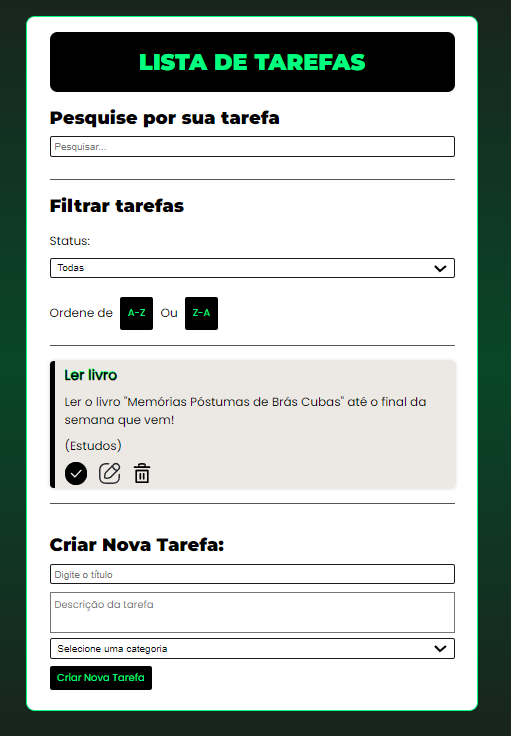

<h1 align="center"> Lista de Tarefas Interativa</h1>

Sistema completo de gerencimaneto de tarefas, para você registrar as tarefas diárias que você precisa fazer. 

 

  

## 🚀 Tecnologias

Esse projeto foi desenvolvido com as seguintes tecnologias:

- React JS
- CSS
- Git e Github

## 💻 Projeto

Aplicação web utilizando React que permite aos usuários criar, editar e excluir tarefas em uma lista interativa. A aplicação inclui funcionalidades como marcação de conclusão, filtragem de tarefas e armazenamento local para manter as tarefas mesmo após o recarregamento da página.

## Créditos

Feito por:
 Dário Klein